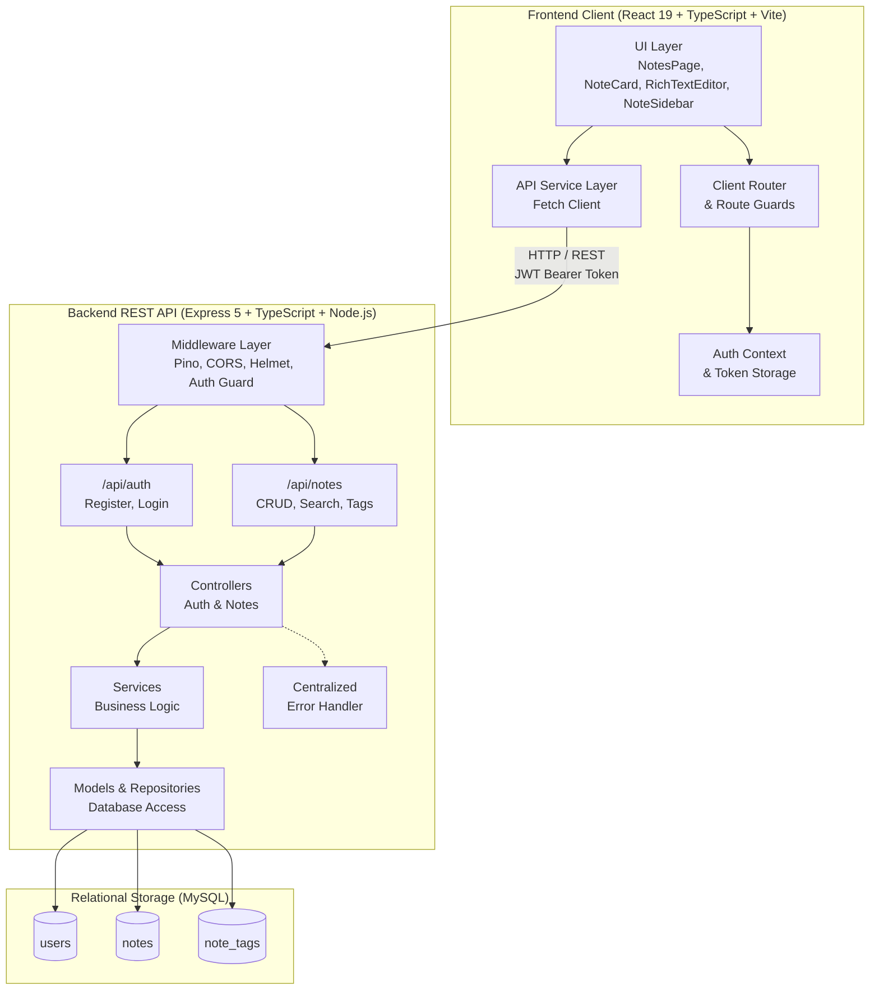
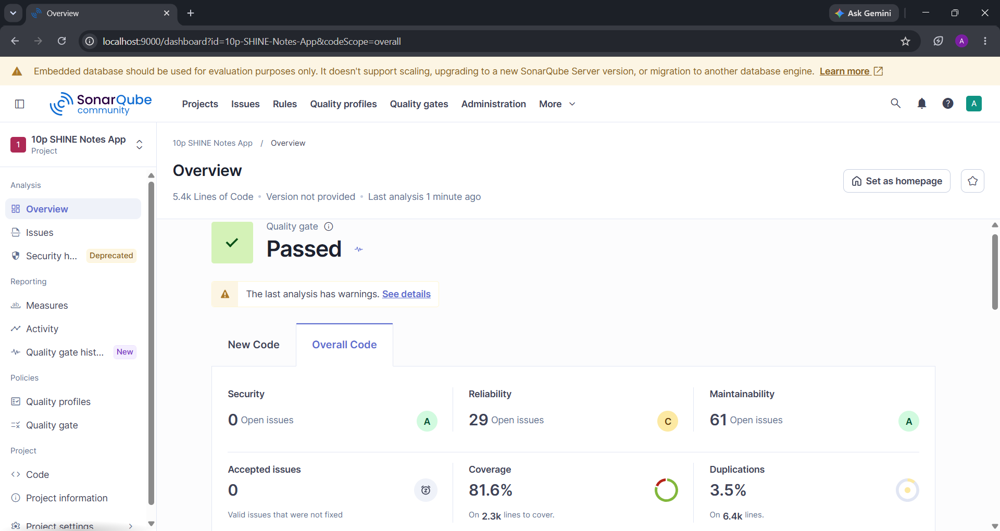
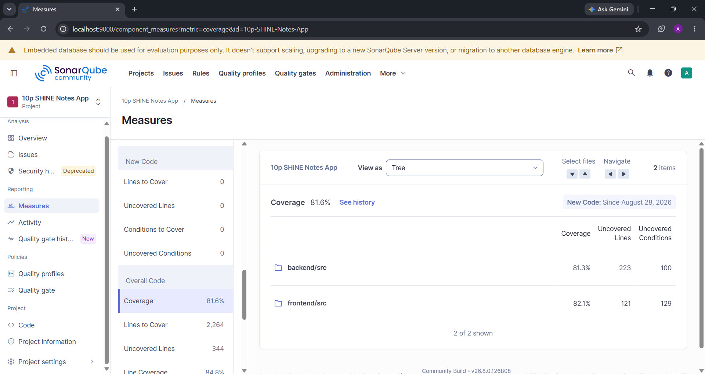
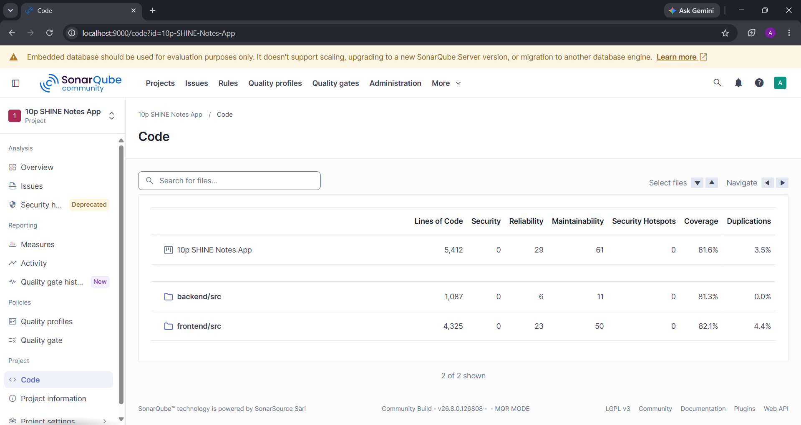
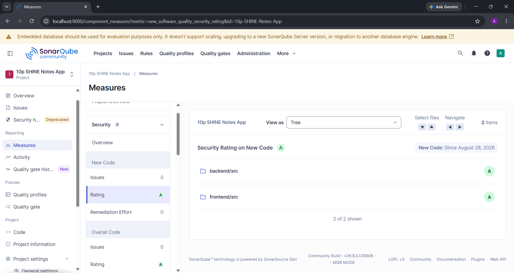

# SHINE Notes App

A full-stack note-taking application built with **React, Node.js, Express, TypeScript, and MySQL** for the **10Pearls SHINE program**.

The application provides JWT-based authentication, rich-text note creation and editing with Tiptap, a responsive masonry workspace, automatic note synchronization, tagging and search, structured logging with sensitive-field redaction, centralized error handling, behavioral testing, and SonarQube-based code quality analysis.

---

## Table of Contents

* [Overview](#overview)
* [Key Features](#key-features)
* [Application Architecture & Note Lifecycle](#application-architecture--note-lifecycle)

  * [Auto-Save Flow](#auto-save-flow)
  * [Auto-Delete Flow](#auto-delete-flow)
  * [Expand & Collapse Flow](#expand--collapse-flow)
* [System Architecture](#system-architecture)
* [Tech Stack](#tech-stack)
* [Database Schema](#database-schema)
* [Project Structure](#project-structure)
* [API Reference](#api-reference)
* [Security & Logging Architecture](#security--logging-architecture)
* [Prerequisites](#prerequisites)
* [Environment Variables](#environment-variables)
* [Installation & Setup](#installation--setup)
* [Running the Application](#running-the-application)
* [Testing](#testing)
* [Code Quality & SonarQube Analysis](#code-quality--sonarqube-analysis)
* [Development Workflow](#development-workflow)
* [Project Status](#project-status)

---

## Overview

The **SHINE Notes App** is a productivity workspace that allows authenticated users to create, organize, edit, search, and manage rich-text notes.

The application is divided into two main tiers:

### Backend REST API

The backend is an **Express 5 / Node.js** service written in TypeScript. It provides:

* JWT-based authentication and authorization
* User and note management
* MySQL persistence using connection pooling
* Transactional tag operations
* Ownership-based data isolation
* Structured logging with Pino
* Centralized error handling
* Security middleware using Helmet and CORS

### Frontend Application

The frontend is a **React 19 / Vite** application written in TypeScript. It provides:

* Authentication screens
* Rich-text note editing
* Responsive masonry-style note layout
* Tag management
* Debounced search
* Automatic note synchronization
* Empty-draft cleanup
* Protected routes
* Interactive note workspace

---

## Key Features

### Authentication & Authorization

* User registration and login
* Password hashing with bcrypt
* Stateless JWT authentication
* Authorization through Bearer tokens
* Protected note endpoints
* User-specific note ownership isolation

### Rich-Text Notes

Powered by **Tiptap**, the editor supports:

* Headings
* Bold and italic text
* Bullet lists
* Numbered lists
* Blockquotes
* Code blocks
* Undo and redo
* Placeholder text

### Dynamic Note Workspace

The notes workspace uses a responsive multi-column layout that adapts between one and three columns depending on the available viewport width.

Notes can be expanded directly within the workspace without requiring a separate modal or editing page.

### Automatic Note Synchronization

Notes are edited locally while the user is interacting with the editor and synchronized with the backend when the editing interaction ends.

The workflow supports:

* Creating new notes
* Updating existing notes
* Saving title, content, and tags
* Maintaining the active editing state if synchronization fails

### Automatic Empty-Draft Cleanup

Empty notes are automatically removed when the editing session is closed.

This prevents unused draft records from accumulating in the database and keeps the workspace clean.

### Tagging & Filtering

Notes can contain multiple tags.

The application provides:

* Tag creation
* Tag removal
* Tag badges
* Tag-based filtering
* Tag aggregation
* Relational tag storage

### Debounced Search

The workspace provides debounced search across note titles and content.

Search requests are sent to the backend after the user pauses typing, reducing unnecessary API requests while maintaining responsive filtering.

### Structured Logging

The backend uses **Pino** and **pino-http** for structured application and HTTP logging.

Log severity is automatically determined based on HTTP response status:

* `5xx` → `error`
* `4xx` → `warn`
* Successful requests → `info`

Sensitive authentication and credential fields are automatically redacted.

### Centralized Error Handling

A centralized Express error-handling layer provides consistent API error responses.

The system handles application errors, malformed JSON requests, unknown routes, authentication failures, and other server-side exceptions without exposing internal implementation details.

### Behavioral & Interaction Testing

The testing strategy focuses on **observable application behavior**.

Backend tests exercise real HTTP API requests against running Express server instances, while frontend tests use React Testing Library to simulate user interactions against rendered components.

### SonarQube Quality Verification

The project includes SonarQube static analysis and combined frontend/backend coverage reporting.

The final analysis reports:

* **Quality Gate:** Passed
* **Overall Coverage:** 81.6%
* **Frontend Coverage:** 82.1%
* **Backend Coverage:** 81.3%
* **Security Rating:** A
* **Open Security Vulnerabilities:** 0
* **Security Hotspots:** 0
* **Maintainability Rating:** A
* **Duplicated Lines:** 3.5%
* **Lines of Code Analyzed:** 5,412

---

## Application Architecture & Note Lifecycle

The application is designed around an in-place note editing experience. Users can create or edit notes directly within the workspace without navigating to a separate editor page.

### Auto-Save Flow

```text
[ User Creates or Opens a Note ]
              │
              ▼
       [ Note Expands ]
              │
              ▼
       [ User Edits Note ]
              │
              ▼
 [ User Closes / Leaves Editor ]
              │
              ▼
      [ Synchronization ]
              │
       ┌──────┴──────┐
       ▼             ▼
   New Note      Existing Note
       │             │
       ▼             ▼
   POST /notes    PUT /notes/:id
       │             │
       └──────┬──────┘
              ▼
       [ Compact Preview ]
```

The editor keeps changes local while the user is actively editing. When the editing interaction ends, the client synchronizes the note with the backend.

If synchronization fails, the note remains in the editing state so the user can retry without immediately losing their changes.

### Auto-Delete Flow

```text
[ User Closes Empty Note ]
            │
            ▼
     [ Empty Draft Check ]
            │
       ┌────┴────┐
       ▼         ▼
   Local Draft  Saved Note
       │         │
       ▼         ▼
 Remove Local  DELETE /notes/:id
    State           │
       │            │
       └─────┬──────┘
             ▼
      [ Workspace Updates ]
```

If a note contains neither a title nor content when it is closed, it is treated as an empty draft.

* Unsaved drafts are removed from the client state.
* Previously persisted notes are deleted through the API.
* Associated tag records are removed through database cascade rules.

### Expand & Collapse Flow

A collapsed note acts as a formatted preview.

When the user selects a note:

1. The card expands in place.
2. The title becomes editable.
3. The Tiptap editor becomes active.
4. Word and character counts update as content changes.
5. Tags can be added or removed.
6. Closing the note triggers synchronization or empty-draft cleanup.

The workspace also prevents multiple notes from remaining actively expanded at the same time.

---

## System Architecture



---

## Tech Stack

### Frontend

| Technology                     | Purpose                                                   |
| :----------------------------- | :-------------------------------------------------------- |
| **React 19**                   | Core UI framework                                         |
| **TypeScript**                 | Static typing across the frontend                         |
| **Vite**                       | Development server and build tooling                      |
| **Tiptap**                     | Rich-text editor                                          |
| **Vanilla CSS**                | Layout, responsive styling, animations, and visual system |
| **Jest**                       | Frontend test runner                                      |
| **React Testing Library**      | Component and interaction testing                         |
| **ESLint / typescript-eslint** | Code quality and linting                                  |

### Backend

| Technology         | Purpose                             |
| :----------------- | :---------------------------------- |
| **Node.js**        | Server runtime                      |
| **Express 5**      | REST API framework                  |
| **TypeScript**     | Static typing across the backend    |
| **MySQL 8**        | Relational database                 |
| **mysql2/promise** | MySQL driver and connection pooling |
| **jsonwebtoken**   | JWT generation and verification     |
| **bcryptjs**       | Password hashing                    |
| **Pino**           | Structured application logging      |
| **pino-http**      | HTTP request logging                |
| **Helmet**         | HTTP security headers               |
| **CORS**           | Cross-origin request configuration  |

### Testing & Quality

| Tool                      | Purpose                                                           |
| :------------------------ | :---------------------------------------------------------------- |
| **Mocha**                 | Backend test runner                                               |
| **Chai**                  | Backend assertions                                                |
| **c8**                    | Backend V8 coverage                                               |
| **Jest**                  | Frontend test runner                                              |
| **React Testing Library** | Frontend behavioral testing                                       |
| **ts-jest**               | TypeScript/Jest integration                                       |
| **SonarQube Community**   | Static analysis, security analysis, and quality gate verification |

---

## Database Schema

The application uses three primary MySQL tables.

```text
users
  │
  │  one-to-many
  ▼
notes
  │
  │  one-to-many
  ▼
note_tags
```

| Table       | Purpose                                       |
| :---------- | :-------------------------------------------- |
| `users`     | Stores authenticated user accounts            |
| `notes`     | Stores user-owned notes and rich-text content |
| `note_tags` | Stores tags associated with individual notes  |

### Relationships

* A user can own multiple notes.
* Every note belongs to a user.
* A note can have multiple tags.
* Deleting a user cascades to their notes.
* Deleting a note cascades to its associated tag records.

The database uses foreign-key constraints to maintain relational integrity.

---

## Project Structure

```text
cohort-9-mern-14096-syed/
│
├── backend/
│   ├── src/
│   │   ├── config/
│   │   │   ├── database.ts
│   │   │   └── index.ts
│   │   │
│   │   ├── controllers/
│   │   │   ├── authController.ts
│   │   │   └── noteController.ts
│   │   │
│   │   ├── middleware/
│   │   │   ├── auth.ts
│   │   │   ├── errorHandler.ts
│   │   │   └── notFound.ts
│   │   │
│   │   ├── models/
│   │   │   ├── note.ts
│   │   │   └── user.ts
│   │   │
│   │   ├── repositories/
│   │   │
│   │   ├── routes/
│   │   │   ├── index.ts
│   │   │   └── notes.ts
│   │   │
│   │   ├── services/
│   │   │   ├── authService.ts
│   │   │   └── noteService.ts
│   │   │
│   │   ├── test/
│   │   │   ├── auth.test.ts
│   │   │   ├── error.test.ts
│   │   │   ├── notes.test.ts
│   │   │   └── setup.ts
│   │   │
│   │   ├── types/
│   │   ├── utils/
│   │   │   ├── auth.ts
│   │   │   └── logger.ts
│   │   │
│   │   ├── app.ts
│   │   ├── server.ts
│   │   └── smoke-test.ts
│   │
│   ├── .env.example
│   ├── package.json
│   └── tsconfig.json
│
├── frontend/
│   ├── src/
│   │   ├── assets/
│   │   ├── components/
│   │   │   ├── common/
│   │   │   ├── layout/
│   │   │   └── notes/
│   │   ├── config/
│   │   ├── context/
│   │   ├── pages/
│   │   ├── router/
│   │   ├── services/
│   │   ├── test/
│   │   ├── types/
│   │   ├── App.css
│   │   ├── App.tsx
│   │   ├── index.css
│   │   └── main.tsx
│   │
│   ├── .env.example
│   ├── jest.config.cjs
│   ├── package.json
│   ├── tsconfig.app.json
│   ├── tsconfig.json
│   ├── tsconfig.test.json
│   └── vite.config.ts
│
├── sonarqube-report/
│   ├── code-overview.png
│   ├── coverage.png
│   ├── overview-sunarqube.png
│   └── security.png
│
├── sonar-project.properties
└── README.md
```

---

## API Reference

All API endpoints are prefixed with `/api`.

Protected endpoints require:

```http
Authorization: Bearer <token>
```

### Health Check

| Method | Endpoint      | Auth Required | Description               | Response |
| :----- | :------------ | :------------ | :------------------------ | :------- |
| `GET`  | `/api/health` | No            | Verifies API availability | `200 OK` |

### Authentication

| Method | Endpoint             | Auth Required | Request Body                | Response      |
| :----- | :------------------- | :------------ | :-------------------------- | :------------ |
| `POST` | `/api/auth/register` | No            | `{ name, email, password }` | `201 Created` |
| `POST` | `/api/auth/login`    | No            | `{ email, password }`       | `200 OK`      |

### Notes

| Method   | Endpoint         | Auth Required | Parameters                     | Response         |
| :------- | :--------------- | :------------ | :----------------------------- | :--------------- |
| `GET`    | `/api/notes`     | Yes           | `?search=<term>&tag=<name>`    | `200 OK`         |
| `POST`   | `/api/notes`     | Yes           | `{ title, content, tags: [] }` | `201 Created`    |
| `GET`    | `/api/notes/:id` | Yes           | `id`                           | `200 OK`         |
| `PUT`    | `/api/notes/:id` | Yes           | `{ title, content, tags: [] }` | `200 OK`         |
| `DELETE` | `/api/notes/:id` | Yes           | `id`                           | `204 No Content` |

---

## Security & Logging Architecture

### Authentication & Authorization

#### Password Hashing

User passwords are hashed using **bcryptjs** before being stored in the database.

The application does not store plaintext passwords.

#### JWT Authentication

Successful authentication generates a signed JSON Web Token.

Authenticated requests provide the token using:

```http
Authorization: Bearer <token>
```

The authentication middleware verifies the token and associates the authenticated user with the request.

#### Ownership Isolation

Note operations are scoped to the authenticated user's ID.

This prevents one user from retrieving, modifying, or deleting another user's notes.

### Structured Logging

The backend uses **Pino** with **pino-http**.

HTTP logs are categorized according to response status:

```text
5xx → error
4xx → warn
2xx/3xx → info
```

### Sensitive Field Redaction

Sensitive request fields are automatically redacted from logs, including:

* Authorization headers
* Cookies
* Authentication tokens
* Password fields
* Secret fields

This reduces the risk of credentials and authentication material appearing in application logs.

### Centralized Error Handling

The backend uses a centralized error-handling middleware with custom `AppError` support.

The error-handling layer:

* Provides consistent JSON error responses
* Handles malformed JSON requests
* Handles unknown routes
* Prevents database internals from being exposed
* Prevents server stack traces from being returned to clients
* Separates internal error details from user-facing messages

---

## Prerequisites

Before running the project, ensure the following are installed:

* **Node.js:** 20.19.0 or higher
* **npm:** 9.x or higher
* **MySQL:** 8.0 or higher

A MySQL database can be hosted locally or remotely.

---

## Environment Variables

### Backend

Create:

```text
backend/.env
```

based on:

```text
backend/.env.example
```

Example configuration:

```env
PORT=5000
NODE_ENV=development
CORS_ORIGIN=http://localhost:5173

# MySQL Database Configuration
DB_HOST=localhost
DB_PORT=3306
DB_USER=your_db_user
DB_PASSWORD=your_db_password
DB_NAME=notes_app

# JWT Configuration
JWT_SECRET=your_jwt_secret_key_here
JWT_EXPIRES_IN=7d
```

### Frontend

Create:

```text
frontend/.env
```

based on:

```text
frontend/.env.example
```

Example:

```env
VITE_API_BASE_URL=http://localhost:5000/api
```

> Never commit actual credentials, database passwords, or JWT secrets to version control.

---

## Installation & Setup

### 1. Clone the Repository

```bash
git clone https://github.com/10pshine-cohort-9/cohort-9-mern-14096-syed/
cd cohort-9-mern-14096-syed
```

### 2. Configure MySQL

Make sure your MySQL server is running.

Create the database configured in `backend/.env`:

```sql
CREATE DATABASE notes_app;
```

The application initializes the required tables when the backend starts.

### 3. Install Backend Dependencies

```bash
cd backend
npm install
```

### 4. Install Frontend Dependencies

```bash
cd ../frontend
npm install
```

### 5. Configure Environment Variables

Create the `.env` files described in the [Environment Variables](#environment-variables) section.

---

## Running the Application

### Development Mode

The frontend and backend run independently.

### 1. Start the Backend

```bash
cd backend
npm run dev
```

The backend development server runs on:

```text
http://localhost:5000
```

### 2. Start the Frontend

In a separate terminal:

```bash
cd frontend
npm run dev
```

The frontend development server runs on:

```text
http://localhost:5173
```

---

## Production Build & Preview

### Backend

Build the backend:

```bash
cd backend
npm run build
```

Start the compiled application:

```bash
npm start
```

### Frontend

Build the frontend:

```bash
cd frontend
npm run build
```

Preview the production build:

```bash
npm run preview
```

---

## Testing

The project uses a layered testing strategy focused on **observable user and API behavior**.

### Testing Philosophy

The backend tests are intentionally centered around **HTTP-based integration and behavioral testing** rather than testing Express middleware functions in isolation.

The tests start live Express server instances and send actual HTTP requests using `fetch`.

This allows the test suite to validate behavior through the same API boundary that real clients use.

The frontend uses **Jest and React Testing Library** to validate rendered UI behavior and realistic user interactions.

The overall strategy is:

```text
Backend
   │
   ▼
Real HTTP Requests
   │
   ▼
Express Application
   │
   ▼
Services / Database
   │
   ▼
Observable API Behavior


Frontend
   │
   ▼
Rendered Components
   │
   ▼
User Interactions
   │
   ▼
Observable UI Behavior


SonarQube
   │
   ▼
Combined Coverage + Static Analysis
```

---

### Backend HTTP-Based Integration & Behavioral Testing

The backend test suite uses **Mocha + Chai + c8**.

Tests exercise actual HTTP endpoints and validate complete API workflows from the perspective of an API consumer.

The suite covers:

#### Authentication Workflows

* User registration
* Duplicate email rejection
* Login
* Invalid credential handling
* JWT issuance
* Authentication failures

#### Notes CRUD Workflows

* Note creation
* Note retrieval
* Note updates
* Note deletion
* Multi-tag association
* Tag updates

#### User Data Isolation

The tests verify that users cannot access notes belonging to other users.

This includes attempts to:

* Retrieve another user's note
* Update another user's note
* Delete another user's note

#### Search & Tag Filtering

The test suite verifies:

* Search by note content
* Search by note title
* Tag-based filtering
* Query parameter handling

#### Error Response Behavior

Tests verify appropriate responses for:

* Unknown routes
* Unauthenticated requests
* Malformed JSON
* Invalid input
* Unauthorized note access

They also verify that responses do not expose internal database details or server stack traces.

#### Health Check / Smoke Test

The project includes an automated smoke test that starts the application, verifies the health endpoint through HTTP, and performs clean shutdown handling.

### Backend Commands

Run the complete backend test suite:

```bash
cd backend
npm test
```

Run backend tests with coverage:

```bash
cd backend
npm run test:coverage
```

Run backend type checking:

```bash
cd backend
npm run typecheck
```

---

## Frontend Behavioral & Interaction Testing

The frontend uses **Jest and React Testing Library**.

The tests focus on rendered components and realistic user interactions rather than implementation details.

Coverage includes:

### Authentication

* User input
* Form submission
* Validation
* Authentication errors
* Login and registration behavior

### Notes Workspace

* Note rendering
* Note expansion
* Editor mounting
* Word and character counts
* Tag creation
* Tag removal
* Delete confirmations

### Note Lifecycle

* Automatic synchronization behavior
* Empty-note cleanup
* Closing active notes
* State transitions

### Search & Filtering

* Search input interaction
* Debounced search behavior
* Tag selection
* Filtered note rendering

### Frontend Commands

Run frontend tests:

```bash
cd frontend
npm test
```

Run tests in watch mode:

```bash
npm run test:watch
```

Run tests with coverage:

```bash
npm run test:coverage
```

Run linting:

```bash
npm run lint
```

Run TypeScript type checking:

```bash
npm run typecheck
```

---

## Code Quality & SonarQube Analysis

The project uses **SonarQube Community** for static code analysis, security analysis, maintainability analysis, duplication detection, and test coverage reporting.

The SonarQube configuration is stored in:

```text
sonar-project.properties
```

Frontend and backend coverage reports are combined for project-level analysis.

### Final SonarQube Metrics

| Metric                            | Result     |
| :-------------------------------- | :--------- |
| **Quality Gate**                  | **Passed** |
| **Overall Coverage**              | **81.6%**  |
| **Frontend Coverage**             | **82.1%**  |
| **Backend Coverage**              | **81.3%**  |
| **Security Rating**               | **A**      |
| **Open Security Vulnerabilities** | **0**      |
| **Security Hotspots**             | **0**      |
| **Maintainability Rating**        | **A**      |
| **Duplicated Lines**              | **3.5%**   |
| **Lines of Code Analyzed**        | **5,412**  |

### SonarQube Inspection Reports

The repository includes screenshots of the final SonarQube analysis in:

```text
sonarqube-report/
```

#### Overview & Quality Gate

Shows the overall project status, including the passed Quality Gate and project-level quality metrics.



#### Code Coverage

Shows the coverage distribution across the frontend and backend codebases.



#### Code Measures

Provides a detailed overview of code quality metrics including reliability, maintainability, duplication, and coverage.



#### Security

Shows the project's final security rating and security issue status.



> The metrics above represent the final SonarQube analysis captured for the completed project.

---

## Development Workflow

The project follows a feature-based Git workflow with testing and quality checks performed before integration.

### Branching Strategy

Development work is organized through dedicated feature branches.

Typical workflow:

```text
develop
   │
   ├── feature/project-foundation
   ├── feature/backend-auth
   ├── feature/notes-crud
   └── feature/notes-experience-enhancement
```

Feature branches are developed independently and integrated after validation.

### Quality Checks

Before merging changes, the project uses:

* Backend test execution
* Frontend test execution
* TypeScript type checking
* ESLint validation
* Coverage reporting
* SonarQube static analysis

### Engineering Principles

The project emphasizes:

* Separation of frontend and backend responsibilities
* Service-based backend business logic
* Reusable frontend components
* Strong TypeScript typing
* Centralized error handling
* Structured logging
* Secure authentication
* User data isolation
* Behavioral testing
* Automated code-quality verification

---

## Project Status

**Status: Completed**

The SHINE Notes App includes:

* Full-stack React and Express implementation
* JWT authentication
* MySQL persistence
* Rich-text note editing
* Responsive masonry workspace
* Note tagging and search
* Automatic note synchronization
* Empty-draft cleanup
* Structured Pino logging
* Sensitive-field redaction
* Centralized error handling
* Backend HTTP-based integration and behavioral tests
* Frontend component and interaction tests
* TypeScript validation
* SonarQube static analysis
* Passed SonarQube Quality Gate
* Final technical documentation

The project is considered complete following implementation, testing, quality analysis, and documentation.
